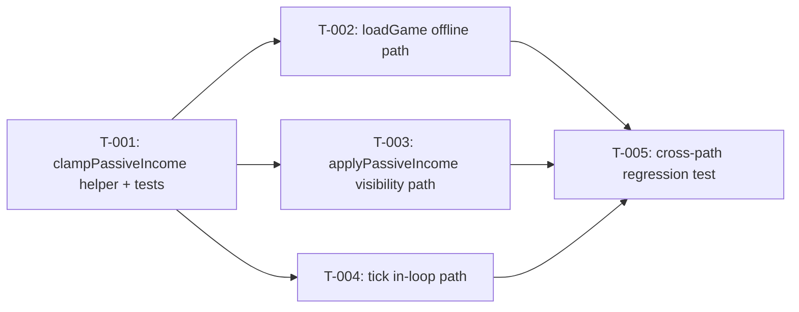

# Build Site

5 tasks across 3 tiers from 1 kit.

---

## Tier 0 — No Dependencies (Start Here)

### T-001: Create shared `clampPassiveIncome` helper with exhaustive unit tests
**Cavekit Requirement:** cavekit-proportional-income/R1
**Acceptance Criteria Mapped:**
- Single shared helper encapsulates the proportional clamp
- Helper: full capacity (available == 0) -> applied gold = 0, applied ore = 0
- Helper: earned sum <= available -> pass-through unchanged
- Helper: earned sum > available, available > 0 -> outputs sum to available and preserve input ratio
- Helper: gold-only with limited capacity -> applied gold = available, applied ore = 0
- Helper: ore-only with limited capacity -> applied ore = available, applied gold = 0
- Helper: zero-zero input -> zero-zero output (no division by zero)
- Unit test for proportional scaling case
**blockedBy:** none
**Effort:** M
**Description:**
Create a new focused module `src/lib/income.ts` that exports a pure function `clampPassiveIncome(earnedGold: number, earnedOre: number, currentGold: number, currentOre: number, maxCapacity: number): { gold: number; ore: number }`. The function implements the contract exactly as specified in R1:
1. Compute `available = maxCapacity - (currentGold + currentOre)`.
2. If `available <= 0`, return `{ gold: 0, ore: 0 }`.
3. If `earnedGold + earnedOre <= available`, return `{ gold: earnedGold, ore: earnedOre }`.
4. Otherwise compute `total = earnedGold + earnedOre`, `ratio = earnedGold / total`, return `{ gold: available * ratio, ore: available * (1 - ratio) }`.
5. Guard explicitly against `earnedGold == 0 && earnedOre == 0` so no ratio is computed in that branch.

Keep the helper pure (no access to `gameState`) so it is trivially testable and reusable across all three call sites.

Create a companion test file `src/lib/income.test.ts` covering all seven helper-level acceptance criteria plus the explicit "proportional scaling case" unit test. Tests to include:
- `returns zero/zero when capacity is already full` (currentGold + currentOre == maxCapacity).
- `returns inputs unchanged when earnings fit within available capacity`.
- `scales proportionally when earnings exceed available capacity` — asserts outputs sum to `available` within a small epsilon and `applied.gold / (applied.gold + applied.ore)` equals input ratio within epsilon.
- `gold-only overflow returns all available capacity as gold` (earnedOre = 0).
- `ore-only overflow returns all available capacity as ore` (earnedGold = 0).
- `zero earnings returns zero/zero and does not throw` (no NaN from 0/0).
- `explicit proportional scaling case` — e.g. earnedGold = 60, earnedOre = 40, available = 50 -> gold = 30, ore = 20 (ratio preserved, sum = available).

**Files:**
- Create: `src/lib/income.ts`
- Create: `src/lib/income.test.ts`

**Test Strategy:** `vp test` runs the new Vitest suite. All seven helper behaviors validated in isolation with no `gameState` mocking required (pure function). Use `expect(value).toBeCloseTo(expected, 6)` for floating-point comparisons.

---

## Tier 1 — Depends on Tier 0

### T-002: Route `loadGame()` offline income through the shared helper
**Cavekit Requirement:** cavekit-proportional-income/R1
**Acceptance Criteria Mapped:**
- `loadGame()` offline-progress application routes offline gold and offline ore through the shared helper before mutating `gameState`
- Neither `currentGold` nor `currentOre` is ever incremented beyond `maxCapacity` by passive income (offline path contribution)
- Unit test for `loadGame()` offline path: offline earnings ratio preserved when over capacity
**blockedBy:** T-001
**Effort:** M
**Description:**
Modify `src/lib/storage.svelte.ts` `loadGame()` so the offline-earned gold and offline-earned ore are combined and passed through `clampPassiveIncome` rather than clamped independently. Concretely:
1. Compute `offlineGold` and `offlineOre` exactly as today (rate * elapsed, etc.).
2. Replace any independent `Math.min(..., maxCapacity - currentGold)` style logic for the offline passive path with a single call `const applied = clampPassiveIncome(offlineGold, offlineOre, gameState.gold, gameState.ore, gameState.maxCapacity)`.
3. Mutate `gameState.gold += applied.gold` and `gameState.ore += applied.ore`.
4. Leave non-passive bookkeeping (lastSaveTime update, etc.) unchanged.

Import the helper from `src/lib/income.ts`. Do not duplicate the clamp math inline. Do not change the offline-time calculation itself (out of scope per kit).

Add a unit test in a new file `src/lib/storage.test.ts` (or extend an existing one if present) that:
- Seeds `gameState` with `currentGold + currentOre` near `maxCapacity` (small remaining `available`).
- Stubs the clock / `lastSaveTime` so computed `offlineGold + offlineOre` exceeds remaining `available`.
- Invokes `loadGame()`.
- Asserts `(deltaGold) / (deltaGold + deltaOre)` equals `offlineGold / (offlineGold + offlineOre)` within epsilon.
- Asserts `gameState.gold + gameState.ore <= maxCapacity` within epsilon.

**Files:**
- Modify: `src/lib/storage.svelte.ts`
- Create or modify: `src/lib/storage.test.ts`

**Test Strategy:** `vp test` verifies the offline path preserves ratio when capacity-constrained. `vp check` validates types and lint after refactor.

---

### T-003: Route `applyPassiveIncome()` tab-visibility catch-up through the shared helper
**Cavekit Requirement:** cavekit-proportional-income/R1
**Acceptance Criteria Mapped:**
- `applyPassiveIncome()` routes catch-up gold and catch-up ore through the shared helper before mutating `gameState`
- Neither `currentGold` nor `currentOre` is ever incremented beyond `maxCapacity` by passive income (visibility path contribution)
- Unit test for `applyPassiveIncome()` visibility path: catch-up earnings ratio preserved when over capacity
**blockedBy:** T-001
**Effort:** M
**Description:**
Modify `applyPassiveIncome(elapsedMs)` in `src/lib/game.svelte.ts` so catch-up gold and catch-up ore are applied through `clampPassiveIncome` in a single combined call. Concretely:
1. Compute `catchUpGold` and `catchUpOre` from rates * elapsed as today.
2. Replace any independent clamping with `const applied = clampPassiveIncome(catchUpGold, catchUpOre, gameState.gold, gameState.ore, gameState.maxCapacity)`.
3. Mutate `gameState.gold += applied.gold` and `gameState.ore += applied.ore`.

Import the helper from `src/lib/income.ts`. Preserve any existing guard clauses (e.g. elapsed <= 0 early return).

Add a unit test in a new file `src/lib/game.test.ts` (or extend if present) named e.g. `applyPassiveIncome preserves gold:ore ratio when catch-up exceeds capacity`:
- Seed `gameState` near capacity.
- Choose an `elapsedMs` such that `catchUpGold + catchUpOre > available`.
- Call `applyPassiveIncome(elapsedMs)`.
- Assert ratio preserved within epsilon and total does not exceed `maxCapacity`.

**Files:**
- Modify: `src/lib/game.svelte.ts`
- Create or modify: `src/lib/game.test.ts`

**Test Strategy:** `vp test` verifies the visibility path preserves ratio when capacity-constrained. Parallelizable with T-002 and T-004 (different call sites).

---

### T-004: Unify `tick()` passive income into a single combined clamp through the shared helper
**Cavekit Requirement:** cavekit-proportional-income/R1
**Acceptance Criteria Mapped:**
- `tick()` routes per-tick gold and per-tick ore through the shared helper in a single combined application (not two independent clamps in separate blocks)
- Neither `currentGold` nor `currentOre` is ever incremented beyond `maxCapacity` by passive income (tick path contribution)
- Unit test for `tick()` path: per-tick earnings ratio preserved when over capacity
**blockedBy:** T-001
**Effort:** M
**Description:**
Refactor the game-loop `tick()` in `src/lib/game.svelte.ts` so ore and gold passive income are computed together and applied through one `clampPassiveIncome` call. Today's code applies ore in one block and gold in a separate block, each with its own independent clamp; this must be unified to match R1's "single combined application" criterion. Concretely:
1. Compute `tickGold` (sum of minion gold/sec contributions for this tick) and `tickOre` (sum of miner ore/sec contributions for this tick) side-by-side, before mutating `gameState`.
2. Remove the two separate clamp-and-add blocks for gold and ore passive income.
3. Replace with a single `const applied = clampPassiveIncome(tickGold, tickOre, gameState.gold, gameState.ore, gameState.maxCapacity)` followed by `gameState.gold += applied.gold; gameState.ore += applied.ore`.
4. Leave non-passive tick concerns unchanged: manual click queue, save cadence, stat recomputation, etc.

Add a unit test in `src/lib/game.test.ts` named e.g. `tick preserves gold:ore ratio when per-tick earnings exceed capacity`:
- Seed `gameState` near capacity with non-zero gold/sec and ore/sec derived stats.
- Invoke `tick()` once (or however the existing exported entrypoint is invoked in tests).
- Assert ratio preserved within epsilon and total does not exceed `maxCapacity`.

**Files:**
- Modify: `src/lib/game.svelte.ts`
- Modify: `src/lib/game.test.ts`

**Test Strategy:** `vp test` verifies the tick path preserves ratio when capacity-constrained. `vp check` confirms the refactor does not introduce type or lint regressions. Parallelizable with T-002 and T-003.

---

## Tier 2 — Depends on Tier 1

### T-005: Regression test — gold receives non-zero proportional share when capacity-constrained
**Cavekit Requirement:** cavekit-proportional-income/R1
**Acceptance Criteria Mapped:**
- Regression unit test: with gold income > 0, ore income > 0, capacity-constrained, ore does not consume 100% of remaining capacity; gold receives a non-zero share proportional to its income rate
**blockedBy:** T-002, T-003, T-004
**Effort:** S
**Description:**
Add a cross-cutting regression unit test that locks in the defect-this-kit-fixes against all three passive-income paths. The intent is to fail if any future change reintroduces an ore-first (or gold-first) ordering that starves the other resource.

For each of the three paths (`loadGame()` offline, `applyPassiveIncome()` visibility catch-up, `tick()` in-loop):
- Seed `gameState` with `currentGold + currentOre` near `maxCapacity` so remaining `available` is small but positive.
- Configure stats so both `goldPerSec > 0` and `orePerSec > 0`.
- Invoke the path with an elapsed value (or tick count) chosen so `earnedGold + earnedOre > available`.
- Assert `deltaGold > 0` (gold is not starved).
- Assert `deltaOre > 0` (ore is not starved).
- Assert `deltaGold / (deltaGold + deltaOre)` equals the incoming rate ratio `goldPerSec / (goldPerSec + orePerSec)` within epsilon.

This test is distinct from T-002/T-003/T-004's per-path ratio tests because it explicitly asserts the "ore does not consume 100%" invariant that motivated this kit and sweeps across all three paths in one file for regression durability.

**Files:**
- Create or modify: `src/lib/income.regression.test.ts` (or colocate inside `src/lib/game.test.ts` under a `describe('regression: proportional share')` block — prefer a dedicated file for discoverability)

**Test Strategy:** `vp test` runs the regression. `vp check` ensures no lint/type regressions.

---

## Tier 3 — Remediation Tasks (from /ck:check inspection)

### T-006: Extract `loadGame()` offline income calculation into testable helper + add ratio test
**Cavekit Requirement:** cavekit-proportional-income/R1 (AC #13)
**Acceptance Criteria Mapped:**
- Unit test for `loadGame()` offline path: ratio preserved when over capacity
**blockedBy:** T-002
**Effort:** M
**Description:**
`loadGame()` in `src/lib/storage.svelte.ts` is browser-gated (`if (!browser) return`) making direct unit testing impossible. Extract the offline income application into a pure function `applyOfflineIncome(state: GameState, elapsedSeconds: number): void` (or returns a delta struct), so the calculation logic can be unit tested without browser APIs.

1. Extract the offline income block (lines ~166-198 in storage.svelte.ts) into `export function applyOfflineIncome(elapsedSeconds: number)` that operates on the imported `game` state directly (no browser dependency).
2. `loadGame()` calls this function when `cappedSeconds > 60`.
3. Add test in `src/lib/storage.test.ts` or `game.test.ts`:
   - Seed `game` near capacity with kobold (gold) + miner (ore) minions
   - Call `applyOfflineIncome(largeDelta)` directly
   - Assert `game.gold + game.ore <= maxCapacity`
   - Assert `deltaGold / (deltaGold + deltaOre)` matches `goldRate / (goldRate + oreRate)` within epsilon

**Files:**
- Modify: `src/lib/storage.svelte.ts`
- Create or modify: `src/lib/storage.test.ts`

---

### T-007: Export `applyTick(delta)` from `startGameLoop` scope and add ratio test
**Cavekit Requirement:** cavekit-proportional-income/R1 (AC #15)
**Acceptance Criteria Mapped:**
- Unit test for `tick()` path: per-tick earnings ratio preserved when over capacity
**blockedBy:** T-004
**Effort:** M
**Description:**
`tick()` in `game.svelte.ts` is a non-exported nested closure inside `startGameLoop()`, making direct unit testing impossible. Extract the per-frame passive income application into `export function applyTick(delta: number)` that can be called directly in tests.

1. Extract the `clampPassiveIncome` call and surrounding capacity/income logic from `tick()` into `export function applyTick(delta: number)`. Keep `tick()` as a thin wrapper that calls `applyTick(clampedDelta)`.
2. Add test in `src/lib/game.test.ts`:
   - Seed `game` at `getCurrentCapacityLimit()` for maxCapacity, gold near full
   - Set kobold + miner minions for mixed gold/ore income
   - Call `applyTick(10)` (large delta, but tick uses it as raw seconds for income)
   - Assert `game.gold + game.ore <= maxCapacity`
   - Assert both `deltaGold > 0` and `deltaOre > 0`

Note: `applyTick` receives pre-clamped delta; the 1s clamp stays inside `tick()`.

**Files:**
- Modify: `src/lib/game.svelte.ts`
- Modify: `src/lib/game.test.ts`

---

### T-008: Expand T-005 regression to cover offline and tick paths
**Cavekit Requirement:** cavekit-proportional-income/R1 (AC #16 regression)
**blockedBy:** T-006, T-007
**Effort:** S
**Description:**
Extend the regression tests to cover all three paths as the plan specified. With T-006 (`applyOfflineIncome`) and T-007 (`applyTick`) exported:

1. Add offline-path regression: seed near capacity, call `applyOfflineIncome(large)`, assert gold non-zero and ore non-zero.
2. Add tick-path regression: seed near capacity, call `applyTick(large)`, assert gold non-zero and ore non-zero.
3. Optionally add ratio assertion (delta ratio matches rate ratio) for both.

**Files:**
- Modify: `src/lib/game.test.ts` or `src/lib/storage.test.ts`

---

## Summary

| Task  | Tier | Effort | Paths Touched                          |
|-------|------|--------|----------------------------------------|
| T-001 | 0    | M      | New helper + tests                     |
| T-002 | 1    | M      | `loadGame()` offline path              |
| T-003 | 1    | M      | `applyPassiveIncome()` visibility path |
| T-004 | 1    | M      | `tick()` in-loop path                  |
| T-005 | 2    | S      | Cross-cutting regression               |
| T-006 | 3    | M      | `loadGame()` offline path test seam    |
| T-007 | 3    | M      | `tick()` path test seam + test         |
| T-008 | 3    | S      | Regression expansion (all 3 paths)     |

Tier 1 tasks T-002, T-003, T-004 are independent of each other and can execute in parallel once T-001 lands.

---

## Coverage Matrix

Every acceptance criterion in cavekit-proportional-income R1 maps to at least one task. Fifteen criteria, fifteen rows.

| # | Acceptance Criterion | Task(s) |
|---|----------------------|---------|
| 1 | A single shared helper encapsulates the proportional clamp and is the only place that decides how passive gold and ore are applied against shared capacity | T-001 (creates helper), T-002 / T-003 / T-004 (each routes its path through it exclusively) |
| 2 | Helper: `currentGold + currentOre == maxCapacity` -> applied gold = 0, applied ore = 0 | T-001 |
| 3 | Helper: `earnedGold + earnedOre <= available` -> pass-through unchanged | T-001 |
| 4 | Helper: overflow with `available > 0` -> outputs sum to available and preserve input ratio | T-001 |
| 5 | Helper: gold-only with limited available -> applied gold = available, applied ore = 0 | T-001 |
| 6 | Helper: ore-only with limited available -> applied ore = available, applied gold = 0 | T-001 |
| 7 | Helper: zero-zero input -> zero-zero output, no division by zero | T-001 |
| 8 | `loadGame()` offline path routes gold + ore through the shared helper before mutating `gameState` | T-002 |
| 9 | `applyPassiveIncome()` visibility path routes gold + ore through the shared helper before mutating `gameState` | T-003 |
| 10 | `tick()` routes per-tick gold and per-tick ore through the shared helper in a single combined application | T-004 |
| 11 | Neither `currentGold` nor `currentOre` is ever incremented by passive income past `maxCapacity` across any of the three paths | T-002 (offline), T-003 (visibility), T-004 (tick) |
| 12 | Unit test for the shared helper: proportional scaling case — outputs sum to `available` and preserve input ratio | T-001 |
| 13 | Unit test for `loadGame()` offline path: ratio preserved when over capacity | T-002 |
| 14 | Unit test for `applyPassiveIncome()` visibility path: ratio preserved when over capacity | T-003 |
| 15 | Unit test for `tick()` path: ratio preserved when over capacity | T-004 |
| 16 (bonus) | Regression: gold receives a non-zero proportional share; ore does not consume 100% | T-005 |

Every one of the 15 kit acceptance criteria has coverage. The regression item (row 16) maps the kit's final "regression unit test" bullet explicitly onto T-005 for traceability.

---

## Dependency Graph

T-002, T-003, T-004 share no edges and are safely parallelizable after T-001.

---

## Architect Report

**Kit read:** `context/kits/cavekit-proportional-income.md` — 1 requirement (R1) with 15 acceptance criteria.

**Framework context confirmed from CLAUDE.md:**
- Svelte 5 with `$state` rune; state in `src/lib/gameState.svelte.ts`, logic in `src/lib/game.svelte.ts`, persistence in `src/lib/storage.svelte.ts`.
- Test runner is Vitest via `vp test`. Test utilities import from `vite-plus/test`.
- CLAUDE.md instructs splitting when a file exceeds ~200–300 lines or mixes concerns; introducing a dedicated `src/lib/income.ts` module for the pure helper matches that guidance and avoids bloating `game.svelte.ts`.
- Prior kits T-001–T-029 are already landed, including `applyPassiveIncome()` from cavekit-save-infrastructure R4. The stated kit dependency is satisfied.

**Plan shape:**
- 5 tasks, 3 tiers. T-001 is the root (pure helper + its own unit tests). T-002, T-003, T-004 each route one of the three documented call sites through the helper with a dedicated path-level ratio test; they are mutually independent. T-005 is a cross-cutting regression test that sweeps all three paths and asserts the motivating defect (ore-first starving gold) is locked out.
- Each of the three paths gets its own task because the call sites live in different files and have different seeding strategies (offline relies on `lastSaveTime`, visibility catch-up relies on elapsed ms argument, tick relies on derived per-second stats). Folding them into one task would obscure blame and complicate parallelization.
- All helper-level criteria (rows 2–7, 12) collapse under T-001 because they are all pure-function contract tests that share the same module and test file. Splitting them would inflate task count without adding dependency signal.

**Risks and watchpoints for builders:**
- Floating-point: tests must use `toBeCloseTo` (or equivalent epsilon) for ratio and sum assertions. The contract explicitly allows floating-point tolerance.
- `tick()` refactor (T-004) is the most likely to surface subtle breakage — it currently applies ore and gold in separate blocks with independent clamps. Builders should ensure the combined clamp runs *after* per-tick rates are computed and *before* any dependent logic (e.g. capacity-based UI `$derived`). Do not accidentally move the clamp after save or loop-bookkeeping code.
- T-002 requires stubbing the clock / `lastSaveTime`. If `storage.svelte.ts` reads `Date.now()` directly, the test should use Vitest fake timers via `vi.useFakeTimers()` from `vite-plus/test`.
- T-003 tests call `applyPassiveIncome(elapsedMs)` directly; ensure it is exported. If it is not, T-003 should add the export as part of the task (no separate task required — the export is a one-line change bundled with the refactor it enables).

**Validation performed:**
- All 15 kit acceptance criteria have coverage in the matrix. No gaps.
- No orphan tasks: every task maps to R1.
- Dependency graph is acyclic. T-001 -> {T-002, T-003, T-004} -> T-005.
- No [CONDITIONAL] or [DYNAMIC] tasks were needed — scope is fully determinable from the kit.
- Effort sizing: four M tasks (one new module + three targeted refactors with tests) and one S task (a regression test that reuses seeding helpers from prior tasks). Total is within a single focused session.
