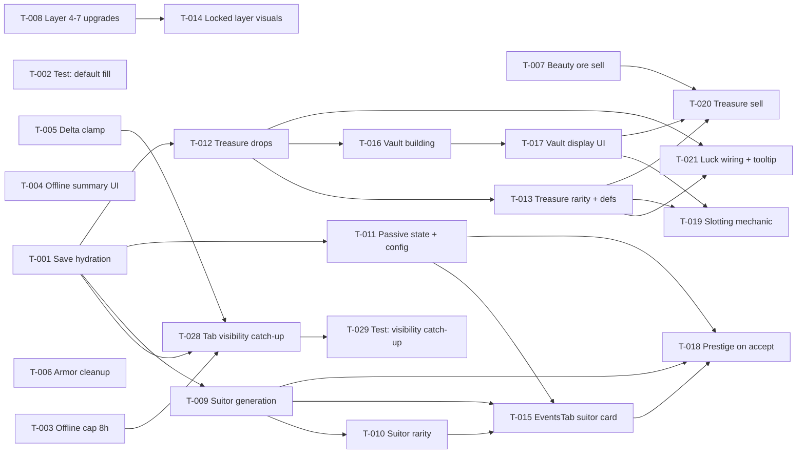

# Build Site

29 tasks across 5 tiers from 4 kits. (T-001–T-021 DONE; T-022–T-027 added after inspection cycle; T-028–T-029 added for save-infrastructure R4.)

---

## Tier 0 — No Dependencies (Start Here)

| Task  | Title                                                    | Cavekit                                                     | Requirement | Effort |
| ----- | -------------------------------------------------------- | ----------------------------------------------------------- | ----------- | ------ |
| T-001 | Add save schema version field and hydration default-fill | cavekit-save-infrastructure.md                              | R1          | M      |
| T-002 | Unit test: save load fills missing field with default    | cavekit-save-infrastructure.md                              | R1          | S      |
| T-003 | Cap offline progress time at 8 hours                     | cavekit-save-infrastructure.md                              | R2          | S      |
| T-004 | Offline progress summary screen UI                       | cavekit-save-infrastructure.md                              | R2          | M      |
| T-005 | Clamp game loop delta to 1 second                        | cavekit-save-infrastructure.md                              | R3          | S      |
| T-006 | Armor stat cleanup (suitor pool + DragonCard display)    | cavekit-suitor-prestige.md + cavekit-progression-systems.md | R6 + R4     | S      |
| T-007 | Beauty trade multiplier on ore sell                      | cavekit-progression-systems.md                              | R1          | M      |
| T-008 | Mountain layer 4-7 upgrade definitions                   | cavekit-progression-systems.md                              | R2          | M      |

### T-001 — Add save schema version field and hydration default-fill

**Kit:** cavekit-save-infrastructure.md R1
**Effort:** M
**Description:** Add a `version` number field to the save schema. Update `hydrateGameState` in `src/lib/storage.svelte.ts` to merge the loaded save into a freshly constructed default `GameState` so any missing field resolves to its default. Handle version mismatch by filling defaults. Ensure adding new fields to `GameState` never leaves existing saves with `undefined`.
**Acceptance:**

- Save schema includes a version number field
- On load, loaded state is merged into a fresh default state so any missing field gets its default value
- hydrateGameState handles version mismatch by filling defaults
- Adding a new field to GameState never causes undefined for existing saves

### T-002 — Unit test: save load fills missing field with default

**Kit:** cavekit-save-infrastructure.md R1
**Effort:** S
**Description:** Add a Vitest unit test that loads a save object missing a new field and asserts the field resolves to its default value after hydration.
**Acceptance:**

- Unit test: load a save missing a new field → field resolves to default value

### T-003 — Cap offline progress time at 8 hours

**Kit:** cavekit-save-infrastructure.md R2
**Effort:** S
**Description:** In `storage.svelte.ts`, clamp the computed time-away to `Math.min(elapsedSeconds, 8 * 3600)` before applying passive income on load. Preserve both the raw and capped durations for later display.
**Acceptance:**

- Time away is capped at 8 \* 3600 seconds before applying passive income
- Unit test: 30-day gap applies exactly 8 hours of passive income

### T-004 — Offline progress summary screen UI

**Kit:** cavekit-save-infrastructure.md R2
**Effort:** M
**Design Ref:** DESIGN.md Section 4 — Components (.panel, .btn-primary) and Section 3 — Typography (VT323 20px body)
**Description:** Build a dismissible offline progress summary panel shown on load when capped offline time exceeds 60 seconds. Display gold earned, ore earned, and time away (both actual and capped if they differ). Use `.panel`, `.btn-primary`, and body typography.
**Acceptance:**

- Summary screen appears when capped offline time exceeds 60 seconds
- Summary screen displays: gold earned, ore earned, time away (actual and capped if different)
- Summary screen is dismissible with a single action
- Summary screen UI uses .panel and .btn-primary per DESIGN.md Section 4
- Summary screen typography uses body type (VT323 20px) per DESIGN.md Section 3

### T-005 — Clamp game loop delta to 1 second

**Kit:** cavekit-save-infrastructure.md R3
**Effort:** S
**Description:** In `game.svelte.ts` game loop, apply `Math.min(delta, 1.0)` before any income calculation so a tab blur or long tick cannot compound into a giant single-frame payout. Add a Vitest verifying a 30s delta produces identical income to a 1s delta.
**Acceptance:**

- Delta is clamped to Math.min(delta, 1.0) before any income calculation in the game loop
- A 30-second delta produces identical income to a 1-second delta
- Unit test: delta of 30s → same income outcome as delta of 1s

### T-006 — Armor stat cleanup (suitor pool + DragonCard display)

**Kit:** cavekit-suitor-prestige.md R6 + cavekit-progression-systems.md R4
**Effort:** S
**Design Ref:** DESIGN.md Section 4 — Components (DragonCard)
**Description:** Merged armor cleanup task. Ensure armor is excluded from any suitor stat pool generator, conditionally hide the armor stat in `DragonCard` when the map system is inactive, and add a code comment indicating armor activates with the future map system.
**Acceptance:**

- Armor does not appear in any suitor stat pool
- Armor stat is conditionally hidden in DragonCard display
- Code note present indicating armor activates with future map system
- Armor stat conditionally hidden in DragonCard (not rendered when map system inactive)
- Code comment present indicating armor activates with future map system

### T-007 — Beauty trade multiplier on ore sell

**Kit:** cavekit-progression-systems.md R1
**Effort:** M
**Design Ref:** DESIGN.md Section 4 — Components (TradeTab)
**Description:** Add `beautyTradeMultiplier` to `config.ts`. Apply `baseTierValue * (1 + beauty * beautyTradeMultiplier)` to ore sell price in TradeTab. Display the effective price including the beauty modifier with a visual indicator. Add a Vitest comparing beauty=0 vs beauty=10.
**Acceptance:**

- Sell price formula: baseTierValue _ (1 + beauty _ beautyTradeMultiplier), with beautyTradeMultiplier in config
- Formula applied to ore sell in TradeTab
- TradeTab displays effective price including beauty modifier with visual indicator
- Unit test: beauty=0 vs beauty=10 → measurably different effective ore sell price

### T-008 — Mountain layer 4-7 upgrade definitions

**Kit:** cavekit-progression-systems.md R2
**Effort:** M
**Description:** Add four upgrade entries (one per layer 4, 5, 6, 7) to the upgrade config. Each carries an ore cost that scales with layer depth. Purchasing an upgrade advances `currentLayerIndex` to the target layer. Upgrades are sequentially gated: layer 5 requires layer 4 to be unlocked, etc. Wire the purchase handler and add a Vitest for layer 4 advancement.
**Acceptance:**

- Four new upgrade entries defined in upgrade config, one per layer (4, 5, 6, 7)
- Each upgrade has an ore cost that scales with layer depth
- Purchasing the upgrade advances currentLayerIndex to the corresponding layer
- Upgrades are sequentially gated — layer 5 upgrade only available after layer 4 is unlocked
- Unit test: purchasing layer 4 upgrade → currentLayerIndex advances to 4

---

## Tier 1 — Depends on Tier 0

| Task  | Title                                                       | Cavekit                        | Requirement | blockedBy | Effort |
| ----- | ----------------------------------------------------------- | ------------------------------ | ----------- | --------- | ------ |
| T-009 | Suitor generation + one-pending gating                      | cavekit-suitor-prestige.md     | R1          | T-001     | L      |
| T-010 | Suitor rarity tiers + beauty-weighted roll                  | cavekit-suitor-prestige.md     | R2          | T-009     | M      |
| T-011 | Passive state fields + config pools + effect application    | cavekit-suitor-prestige.md     | R3          | T-001     | L      |
| T-012 | Treasure inventory state + drop tick hook                   | cavekit-treasure-system.md     | R1          | T-001     | M      |
| T-013 | Treasure rarity tiers + luck weighting + definitions config | cavekit-treasure-system.md     | R2          | T-012     | M      |
| T-014 | Locked mountain layer visual state                          | cavekit-progression-systems.md | R3          | T-008     | S      |
| T-028 | Tab visibility catch-up (save on hide, apply on show)       | cavekit-save-infrastructure.md | R4          | T-001, T-003, T-005 | S      |

### T-009 — Suitor generation + one-pending gating

**Kit:** cavekit-suitor-prestige.md R1
**Effort:** L
**Depends on:** T-001
**Description:** Implement suitor generation in `game.svelte.ts` triggered when gold >= 10000. Compute pool size as `max(1, floor(sqrt(gold / 10000)))`. Pre-allocate stat points into named stats at generation time (not at accept). Persist the pending suitor in `gameState` with all fields required for display and application. Block new suitor generation while one is pending; persist across save/load. Add a Vitest for pool size at 10k, 40k, 90k.
**Acceptance:**

- Suitor generated when gold >= 10000
- Stat pool size = floor(sqrt(gold / 10000)), minimum 1
- Pool size shown to player before accept ("N stat points available")
- Only one pending suitor at a time; new suitor generation blocked while one is pending
- Suitor persists in game state until accepted or declined
- Suitor stored in game state with all fields needed for display and application
- Suitor stat allocations are pre-determined at generation time — card shows allocation, player accepts or declines
- Unit test: 10k gold → 1 stat point, 40k gold → 2 stat points, 90k gold → 3 stat points

### T-010 — Suitor rarity tiers + beauty-weighted roll

**Kit:** cavekit-suitor-prestige.md R2
**Effort:** M
**Depends on:** T-009
**Description:** Add rarity probability weights to `config.ts` (Common, Uncommon, Rare, Epic, Legendary). Implement additive weight adjustment where each beauty point adds a config-defined bonus weight to tiers above Common, reducing effective Common weight proportionally. Rarity tier selects which passive pool the suitor samples. Add a Vitest comparing beauty=0 vs beauty=20 distributions over 100 rolls.
**Acceptance:**

- Rarity probability weights are config-driven, not hardcoded
- Beauty score shifts rarity probability via additive weight adjustment: each beauty point adds a config-defined bonus weight to tiers above Common, reducing effective Common weight proportionally
- Unit test: beauty=0 vs beauty=20 → measurably different rarity distribution over 100 generated suitors
- Rarity tier determines which passive pool is sampled

### T-011 — Passive state fields + config pools + effect application

**Kit:** cavekit-suitor-prestige.md R3
**Effort:** L
**Depends on:** T-001
**Description:** Add `activeGenerationPassive` (nullable) and `lineagePassives[]` (append-only) to `GameState`. Add config-driven passive pools (per rarity tier) to `config.ts`. Apply both passive types additively in income and stat calculations. Ensure lineage bonuses stack additively. Add Vitests for effect application and for lineage stacking across multiple breeds.
**Acceptance:**

- Game state includes activeGenerationPassive (nullable). SET by accept (not cleared by resetHoard()). Call order: (1) apply stat gains, (2) set activeGenerationPassive, (3) append to lineagePassives[], (4) call resetHoard().
- Game state includes lineagePassives[] (append-only, never cleared by resetHoard())
- Passive effects from both types are applied in income and stat calculations
- Lineage passive bonuses stack additively
- Passive pools are config-driven, not hardcoded
- Unit test: accepting suitor with known passives → income calculations reflect those passives
- Unit test: lineage passive bonuses stack correctly across multiple breeds

### T-012 — Treasure inventory state + drop tick hook

**Kit:** cavekit-treasure-system.md R1
**Effort:** M
**Depends on:** T-001
**Description:** Add `treasureInventory[]` (items `{id, rarity, name, effectType, effectMagnitude, tradeValue, slotted: boolean}`) to `GameState`. Add `baseTreasureChance` and `luckMultiplier` to `config.ts`. Implement drop roll using `baseTreasureChance * (1 + luck * luckMultiplier)` on each miner passive tick and each manual burrow click. New drops are added as `slotted: false` (inert). Add a Vitest comparing luck=0 vs luck=10 rates over 1000 ticks.
**Acceptance:**

- Drop chance formula: baseTreasureChance _ (1 + luck _ luckMultiplier), all values config-driven
- Drops can occur on each miner passive tick and on each manual burrow click
- Dropped treasures added to treasureInventory[] in game state as unslotted (inert)
- Unit test: luck=0 vs luck=10 → measurably different drop rate over 1000 ticks

### T-013 — Treasure rarity tiers + luck weighting + definitions config

**Kit:** cavekit-treasure-system.md R2
**Effort:** M
**Depends on:** T-012
**Description:** Add treasure rarity weight config and treasure definition entries (name, rarity, flavor text, effect type, effect magnitude, flat trade gold value). Apply the same additive weight adjustment used for suitor rarity: each luck point adds a config-defined bonus weight to tiers above Common. Effects remain inert until slotted. Add a Vitest comparing luck=0 vs luck=10 rarity distribution over 100 drops.
**Acceptance:**

- Rarity probability weights are config-driven
- Luck stat shifts rarity probability via additive weight adjustment (same mechanism as suitor rarity): each luck point adds a config-defined bonus weight to tiers above Common
- Each treasure definition includes: name, rarity, flavor text, effect type, effect magnitude, flat trade gold value
- All treasure definitions are config-driven, not hardcoded
- Effects are inert until treasure is slotted in Treasure Vault
- Unit test: luck=0 vs luck=10 → measurably different rarity distribution over 100 drops

### T-014 — Locked mountain layer visual state

**Kit:** cavekit-progression-systems.md R3
**Effort:** S
**Depends on:** T-008
**Design Ref:** DESIGN.md Section 2 — Color (text-muted #7A8A74, bg-surface, text-primary #E8DFC0)
**Description:** Render locked layers with muted styling (text-muted #7A8A74, bg-surface background) and show each locked layer's ore unlock requirement ("Requires N ore"). Unlocked layers use full color styling (text-primary #E8DFC0). Ensure visual distinction is clear without additional labels.
**Acceptance:**

- Locked layers render with muted styling per DESIGN.md Section 2 (text-muted #7A8A74, bg-surface background)
- Each locked layer shows its ore unlock requirement ("Requires N ore")
- Unlocked layers render with full color styling per DESIGN.md Section 2 (text-primary #E8DFC0)
- Visual distinction between locked and unlocked layers is clear without additional labels

---

## Tier 2 — Depends on Tier 1

| Task  | Title                                        | Cavekit                    | Requirement | blockedBy           | Effort |
| ----- | -------------------------------------------- | -------------------------- | ----------- | ------------------- | ------ |
| T-015 | EventsTab suitor card UI                     | cavekit-suitor-prestige.md | R4          | T-009, T-010, T-011 | L      |
| T-016 | Treasure Vault building + BuildingsTab entry | cavekit-treasure-system.md | R3          | T-012               | M      |
| T-017 | Treasure Vault display UI                    | cavekit-treasure-system.md | R3          | T-016               | M      |
| T-029 | Unit test: tab visibility catch-up           | cavekit-save-infrastructure.md | R4      | T-028               | S      |

### T-015 — EventsTab suitor card UI

**Kit:** cavekit-suitor-prestige.md R4
**Effort:** L
**Depends on:** T-009, T-010, T-011
**Design Ref:** DESIGN.md Section 2 — Color (rarity colors), Section 3 — Typography (body type), Section 4 — Components (.panel, .dither, .btn-primary, .btn-secondary)
**Description:** Build the EventsTab suitor card. When a suitor is pending, display name, rarity tier, stat pool size, individual stat allocations, and passive preview with description. Rarity color indicator maps: Common → text-secondary, Uncommon → forest, Rare → stream, Epic → gold, Legendary → ember. Card uses `.panel` and `.dither`; Accept button uses `.btn-primary`, Decline uses `.btn-secondary`. Show empty state when no suitor pending; generation-0 starter dragon empty state includes flavor text indicating no suitors yet. Empty state text uses body typography.
**Acceptance:**

- EventsTab shows suitor card when a suitor is pending
- Suitor card displays: name, rarity tier, stat pool size, individual stat allocations, passive preview with description
- Rarity color indicator uses DESIGN.md Section 2 colors: Common text-secondary, Uncommon forest, Rare stream, Epic gold, Legendary ember
- Suitor card uses .panel and .dither per DESIGN.md Section 4
- Accept button uses .btn-primary, decline button uses .btn-secondary per DESIGN.md Section 4
- Empty state shown when no suitor pending
- Starter dragon (generation 0) empty state includes flavor text indicating no suitors yet
- Empty state text uses body type per DESIGN.md Section 3

### T-016 — Treasure Vault building + BuildingsTab entry

**Kit:** cavekit-treasure-system.md R3
**Effort:** M
**Depends on:** T-012
**Design Ref:** DESIGN.md Section 4 — Components (.panel, BuildingsTab)
**Description:** Add Treasure Vault to building config with unlock cost and initial slot count. Ensure treasures accumulate inertly without the vault. Add entry to BuildingsTab (Construction section). Ensure `resetHoard()` wipes the vault building so it must be repurchased each generation (intentional). No vault-slot upgrade scaffolding in this kit.
**Acceptance:**

- Treasure Vault defined in building config with an unlock cost
- Without a purchased Treasure Vault, treasures accumulate in inventory with no effect
- Treasure Vault appears in BuildingsTab (Construction section)
- Initial slot count defined in config
- Slot capacity may be expanded in a future kit; no upgrade scaffolding for vault slots required in this kit
- Treasure Vault building is wiped by resetHoard() — player must repurchase each generation (intentional)

### T-017 — Treasure Vault display UI

**Kit:** cavekit-treasure-system.md R3
**Effort:** M
**Depends on:** T-016
**Design Ref:** DESIGN.md Section 2 — Color (rarity colors), Section 4 — Components (.panel)
**Description:** Build vault UI panel displaying slotted treasures, empty slots, and total slot count. Apply rarity colors: Common → text-secondary, Uncommon → forest, Rare → stream, Legendary → gold. Use `.panel`.
**Acceptance:**

- Vault UI displays slotted treasures, empty slots, and total slot count
- Vault UI uses .panel per DESIGN.md Section 4
- Rarity colors follow DESIGN.md Section 2: Common text-secondary, Uncommon forest, Rare stream, Legendary gold

---

## Tier 3 — Depends on Tier 2

| Task  | Title                                                      | Cavekit                                                     | Requirement | blockedBy           | Effort |
| ----- | ---------------------------------------------------------- | ----------------------------------------------------------- | ----------- | ------------------- | ------ |
| T-018 | Prestige on accept: apply stats, set passives, reset hoard | cavekit-suitor-prestige.md                                  | R5          | T-009, T-011, T-015 | L      |
| T-019 | Treasure slotting mechanic                                 | cavekit-treasure-system.md                                  | R4          | T-013, T-017        | L      |
| T-020 | Treasure trading (sell) with beauty multiplier             | cavekit-treasure-system.md + cavekit-progression-systems.md | R5 + R1     | T-007, T-013, T-017 | M      |
| T-021 | Luck stat wiring + DragonCard tooltip                      | cavekit-treasure-system.md                                  | R6          | T-012, T-013        | S      |

### T-018 — Prestige on accept: apply stats, set passives, reset hoard

**Kit:** cavekit-suitor-prestige.md R5
**Effort:** L
**Depends on:** T-009, T-011, T-015
**Description:** Implement the accept handler in strict call order: (1) apply stat gains exactly as previewed with no additional RNG; (2) replace `activeGenerationPassive` with the suitor's generation passive (or null); (3) append new lineage passives to `lineagePassives[]`; (4) call `resetHoard()`. `resetHoard()` must NOT clear `lineagePassives[]` or `activeGenerationPassive`. Increment `generation`, clear `pendingSuitor`, and call `saveGame()` immediately. Add a Vitest asserting final game state matches preview exactly and that `lineagePassives[]` preserves all prior-generation passives (append-only invariant).
**Acceptance:**

- Stat gains applied exactly as previewed, no additional RNG post-accept
- activeGenerationPassive replaced with the suitor's generation passive (or null if none)
- New lineage passives appended to lineagePassives[]
- resetHoard() called after all stat and passive application; must NOT clear lineagePassives[] or activeGenerationPassive
- lineagePassives[] contains all passives from all prior generations after prestige (append-only invariant)
- generation increments by 1
- pendingSuitor cleared from state
- saveGame() called immediately after prestige
- Unit test: accept suitor with known stats and passives → game state matches preview exactly

### T-019 — Treasure slotting mechanic

**Kit:** cavekit-treasure-system.md R4
**Effort:** L
**Depends on:** T-013, T-017
**Description:** Implement slot/unslot actions in the vault UI. Slotting flips `slotted: true` and applies the treasure's effect immediately in income/stat calculations; unslotting reverts the effect immediately. Vault occupancy = count of `slotted: true` items versus `vaultSlots` config integer (no separate state array). Block slotting when no empty slots remain; player must unslot first. Persist slotted/unslotted state across saves. `resetHoard()` clears both slotted and inventory treasures. Add a Vitest asserting income reflects a slotted treasure's known effect.
**Acceptance:**

- Slot action available from vault UI for each unslotted inventory treasure
- Unslot action available for each occupied vault slot
- Slotted treasure effects applied immediately in income/stat calculations
- Unslotting removes effect immediately
- Cannot slot when no empty slots exist; player must unslot first
- Slotted/unslotted state persists across saves
- Treasures (slotted and inventory) cleared on resetHoard()
- Unit test: slotting a treasure with known effect → income calculation reflects that effect

### T-020 — Treasure trading (sell) with beauty multiplier

**Kit:** cavekit-treasure-system.md R5 + cavekit-progression-systems.md R1 (cross-ref)
**Effort:** M
**Depends on:** T-007, T-013, T-017
**Design Ref:** DESIGN.md Section 4 — Components (.panel, .btn-primary)
**Description:** Add sell action to the vault UI, available only for unslotted treasures. Sell price formula: `baseTierValue * (1 + beauty * beautyTradeMultiplier)`, values config-driven (same multiplier as ore sell). Display sell price before confirming the trade. Selling removes the treasure from inventory and adds gold. Block selling a slotted treasure until unslotted. Add a Vitest comparing beauty=0 vs beauty=10 effective sell prices.
**Acceptance:**

- Sell price formula: baseTierValue _ (1 + beauty _ beautyTradeMultiplier), values config-driven
- Sell action available only for unslotted treasures
- Selling removes treasure from inventory and adds gold
- Cannot sell a slotted treasure without unslotting first
- Sell price shown before confirming trade
- Unit test: beauty=0 vs beauty=10 → measurably different effective sell price
- Formula applied to treasure sell (cross-ref: cavekit-treasure-system.md R5)

### T-021 — Luck stat wiring + DragonCard tooltip

**Kit:** cavekit-treasure-system.md R6
**Effort:** S
**Depends on:** T-012, T-013
**Design Ref:** DESIGN.md Section 4 — Components (DragonCard)
**Description:** Confirm the luck stat value drives both drop rate (R1) and rarity weighting (R2) via a single source. Add a tooltip on the DragonCard luck stat with text: "Affects treasure find rate and rarity". Add a Vitest asserting changing luck changes both drop rate and rarity distribution.
**Acceptance:**

- Luck stat value drives drop rate calculation (R1) and rarity weighting (R2)
- DragonCard displays luck stat with tooltip: "Affects treasure find rate and rarity"
- Unit test: changing luck stat value → drop rate and rarity distribution change accordingly

---

## Summary

| Tier | Tasks | Effort       |
| ---- | ----- | ------------ |
| 0    | 8     | 3S / 4M / 1L |
| 1    | 7     | 2S / 3M / 2L |
| 2    | 4     | 1S / 2M / 1L |
| 3    | 4     | 1S / 1M / 2L |
| 4    | 6     | 5S / 1XS     |

**Total: 29 tasks, 5 tiers**

## Coverage Matrix

| Cavekit             | Req | Criterion                                                                                                               | Task(s) | Status  |
| ------------------- | --- | ----------------------------------------------------------------------------------------------------------------------- | ------- | ------- |
| save-infrastructure | R1  | Save schema includes a version number field                                                                             | T-001   | COVERED |
| save-infrastructure | R1  | On load, loaded state is merged into a fresh default state so any missing field gets its default value                  | T-001   | COVERED |
| save-infrastructure | R1  | hydrateGameState handles version mismatch by filling defaults                                                           | T-001   | COVERED |
| save-infrastructure | R1  | Adding a new field to GameState never causes undefined for existing saves                                               | T-001   | COVERED |
| save-infrastructure | R1  | Unit test: load a save missing a new field → field resolves to default value                                            | T-002   | COVERED |
| save-infrastructure | R2  | Time away is capped at 8 \* 3600 seconds before applying passive income                                                 | T-003   | COVERED |
| save-infrastructure | R2  | Summary screen appears when capped offline time exceeds 60 seconds                                                      | T-004   | COVERED |
| save-infrastructure | R2  | Summary screen displays: gold earned, ore earned, time away (actual and capped if different)                            | T-004   | COVERED |
| save-infrastructure | R2  | Summary screen is dismissible with a single action                                                                      | T-004   | COVERED |
| save-infrastructure | R2  | Summary screen UI uses .panel and .btn-primary per DESIGN.md Section 4                                                  | T-004   | COVERED |
| save-infrastructure | R2  | Summary screen typography uses body type (VT323 20px) per DESIGN.md Section 3                                           | T-004   | COVERED |
| save-infrastructure | R2  | Unit test: 30-day gap applies exactly 8 hours of passive income                                                         | T-003   | COVERED |
| save-infrastructure | R3  | Delta is clamped to Math.min(delta, 1.0) before any income calculation in the game loop                                 | T-005   | COVERED |
| save-infrastructure | R3  | A 30-second delta produces identical income to a 1-second delta                                                         | T-005   | COVERED |
| save-infrastructure | R3  | Unit test: delta of 30s → same income outcome as delta of 1s                                                            | T-005   | COVERED |
| save-infrastructure | R4  | Tab going hidden triggers a game save (updates lastSaveTime)                                                            | T-028   | COVERED |
| save-infrastructure | R4  | Tab becoming visible after ≥1 second hidden applies passive gold, ore, and capacity earned for the elapsed duration    | T-028   | COVERED |
| save-infrastructure | R4  | Hidden duration is capped at the same 8-hour offline maximum (R2) before income is applied                              | T-028   | COVERED |
| save-infrastructure | R4  | Progress applies silently — no UI shown; the offline summary screen (R2) is not triggered                              | T-028   | COVERED |
| save-infrastructure | R4  | Hidden duration < 1 second: no catch-up applied                                                                         | T-028   | COVERED |
| save-infrastructure | R4  | Catch-up calculation is independent of the per-frame delta clamp (R3); the full elapsed duration (pre-cap) is used directly | T-028 | COVERED |
| save-infrastructure | R4  | Unit test: visibility catch-up (save on hide, no-op under 1s, normal catch-up, 8h cap, summary not triggered)           | T-029   | COVERED |
| suitor-prestige     | R1  | Suitor generated when gold >= 10000                                                                                     | T-009   | COVERED |
| suitor-prestige     | R1  | Stat pool size = floor(sqrt(gold / 10000)), minimum 1                                                                   | T-009   | COVERED |
| suitor-prestige     | R1  | Pool size shown to player before accept ("N stat points available")                                                     | T-009   | COVERED |
| suitor-prestige     | R1  | Only one pending suitor at a time; new suitor generation blocked while one is pending                                   | T-009   | COVERED |
| suitor-prestige     | R1  | Suitor persists in game state until accepted or declined                                                                | T-009   | COVERED |
| suitor-prestige     | R1  | Suitor stored in game state with all fields needed for display and application                                          | T-009   | COVERED |
| suitor-prestige     | R1  | Suitor stat allocations are pre-determined at generation time — card shows allocation, player accepts or declines       | T-009   | COVERED |
| suitor-prestige     | R1  | Unit test: 10k gold → 1 stat point, 40k gold → 2 stat points, 90k gold → 3 stat points                                  | T-009   | COVERED |
| suitor-prestige     | R2  | Rarity probability weights are config-driven, not hardcoded                                                             | T-010   | COVERED |
| suitor-prestige     | R2  | Beauty score shifts rarity probability via additive weight adjustment                                                   | T-010   | COVERED |
| suitor-prestige     | R2  | Unit test: beauty=0 vs beauty=20 → measurably different rarity distribution over 100 generated suitors                  | T-010   | COVERED |
| suitor-prestige     | R2  | Rarity tier determines which passive pool is sampled                                                                    | T-010   | COVERED |
| suitor-prestige     | R3  | Game state includes activeGenerationPassive (nullable) with documented call order                                       | T-011   | COVERED |
| suitor-prestige     | R3  | Game state includes lineagePassives[] (append-only, never cleared by resetHoard())                                      | T-011   | COVERED |
| suitor-prestige     | R3  | Passive effects from both types are applied in income and stat calculations                                             | T-011   | COVERED |
| suitor-prestige     | R3  | Lineage passive bonuses stack additively                                                                                | T-011   | COVERED |
| suitor-prestige     | R3  | Passive pools are config-driven, not hardcoded                                                                          | T-011   | COVERED |
| suitor-prestige     | R3  | Unit test: accepting suitor with known passives → income calculations reflect those passives                            | T-011   | COVERED |
| suitor-prestige     | R3  | Unit test: lineage passive bonuses stack correctly across multiple breeds                                               | T-011   | COVERED |
| suitor-prestige     | R4  | EventsTab shows suitor card when a suitor is pending                                                                    | T-015   | COVERED |
| suitor-prestige     | R4  | Suitor card displays: name, rarity tier, stat pool size, individual stat allocations, passive preview with description  | T-015   | COVERED |
| suitor-prestige     | R4  | Rarity color indicator uses DESIGN.md Section 2 colors                                                                  | T-015   | COVERED |
| suitor-prestige     | R4  | Suitor card uses .panel and .dither per DESIGN.md Section 4                                                             | T-015   | COVERED |
| suitor-prestige     | R4  | Accept uses .btn-primary, decline uses .btn-secondary per DESIGN.md Section 4                                           | T-015   | COVERED |
| suitor-prestige     | R4  | Empty state shown when no suitor pending                                                                                | T-015   | COVERED |
| suitor-prestige     | R4  | Starter dragon (generation 0) empty state includes flavor text indicating no suitors yet                                | T-015   | COVERED |
| suitor-prestige     | R4  | Empty state text uses body type per DESIGN.md Section 3                                                                 | T-015   | COVERED |
| suitor-prestige     | R5  | Stat gains applied exactly as previewed, no additional RNG post-accept                                                  | T-018   | COVERED |
| suitor-prestige     | R5  | activeGenerationPassive replaced with the suitor's generation passive (or null if none)                                 | T-018   | COVERED |
| suitor-prestige     | R5  | New lineage passives appended to lineagePassives[]                                                                      | T-018   | COVERED |
| suitor-prestige     | R5  | resetHoard() called after all stat and passive application; must NOT clear lineagePassives[] or activeGenerationPassive | T-018   | COVERED |
| suitor-prestige     | R5  | lineagePassives[] contains all passives from all prior generations after prestige (append-only invariant)               | T-018   | COVERED |
| suitor-prestige     | R5  | generation increments by 1                                                                                              | T-018   | COVERED |
| suitor-prestige     | R5  | pendingSuitor cleared from state                                                                                        | T-018   | COVERED |
| suitor-prestige     | R5  | saveGame() called immediately after prestige                                                                            | T-018   | COVERED |
| suitor-prestige     | R5  | Unit test: accept suitor with known stats and passives → game state matches preview exactly                             | T-018   | COVERED |
| suitor-prestige     | R6  | Armor does not appear in any suitor stat pool                                                                           | T-006   | COVERED |
| suitor-prestige     | R6  | Armor stat is conditionally hidden in DragonCard display                                                                | T-006   | COVERED |
| suitor-prestige     | R6  | Code note present indicating armor activates with future map system                                                     | T-006   | COVERED |
| treasure-system     | R1  | Drop chance formula: baseTreasureChance _ (1 + luck _ luckMultiplier), all values config-driven                         | T-012   | COVERED |
| treasure-system     | R1  | Drops can occur on each miner passive tick and on each manual burrow click                                              | T-012   | COVERED |
| treasure-system     | R1  | Dropped treasures added to treasureInventory[] in game state as unslotted (inert)                                       | T-012   | COVERED |
| treasure-system     | R1  | Unit test: luck=0 vs luck=10 → measurably different drop rate over 1000 ticks                                           | T-012   | COVERED |
| treasure-system     | R2  | Rarity probability weights are config-driven                                                                            | T-013   | COVERED |
| treasure-system     | R2  | Luck stat shifts rarity probability via additive weight adjustment                                                      | T-013   | COVERED |
| treasure-system     | R2  | Each treasure definition includes: name, rarity, flavor text, effect type, effect magnitude, flat trade gold value      | T-013   | COVERED |
| treasure-system     | R2  | All treasure definitions are config-driven, not hardcoded                                                               | T-013   | COVERED |
| treasure-system     | R2  | Effects are inert until treasure is slotted in Treasure Vault                                                           | T-013   | COVERED |
| treasure-system     | R2  | Unit test: luck=0 vs luck=10 → measurably different rarity distribution over 100 drops                                  | T-013   | COVERED |
| treasure-system     | R3  | Treasure Vault defined in building config with an unlock cost                                                           | T-016   | COVERED |
| treasure-system     | R3  | Without a purchased Treasure Vault, treasures accumulate in inventory with no effect                                    | T-016   | COVERED |
| treasure-system     | R3  | Treasure Vault appears in BuildingsTab (Construction section)                                                           | T-016   | COVERED |
| treasure-system     | R3  | Vault UI displays slotted treasures, empty slots, and total slot count                                                  | T-017   | COVERED |
| treasure-system     | R3  | Vault UI uses .panel per DESIGN.md Section 4                                                                            | T-017   | COVERED |
| treasure-system     | R3  | Rarity colors follow DESIGN.md Section 2: Common text-secondary, Uncommon forest, Rare stream, Legendary gold           | T-017   | COVERED |
| treasure-system     | R3  | Initial slot count defined in config                                                                                    | T-016   | COVERED |
| treasure-system     | R3  | Slot capacity may be expanded in a future kit; no upgrade scaffolding for vault slots required in this kit              | T-016   | COVERED |
| treasure-system     | R3  | Treasure Vault building is wiped by resetHoard() — player must repurchase each generation (intentional)                 | T-016   | COVERED |
| treasure-system     | R4  | Slot action available from vault UI for each unslotted inventory treasure                                               | T-019   | COVERED |
| treasure-system     | R4  | Unslot action available for each occupied vault slot                                                                    | T-019   | COVERED |
| treasure-system     | R4  | Slotted treasure effects applied immediately in income/stat calculations                                                | T-019   | COVERED |
| treasure-system     | R4  | Unslotting removes effect immediately                                                                                   | T-019   | COVERED |
| treasure-system     | R4  | Cannot slot when no empty slots exist; player must unslot first                                                         | T-019   | COVERED |
| treasure-system     | R4  | Slotted/unslotted state persists across saves                                                                           | T-019   | COVERED |
| treasure-system     | R4  | Treasures (slotted and inventory) cleared on resetHoard()                                                               | T-019   | COVERED |
| treasure-system     | R4  | Unit test: slotting a treasure with known effect → income calculation reflects that effect                              | T-019   | COVERED |
| treasure-system     | R5  | Sell price formula: baseTierValue _ (1 + beauty _ beautyTradeMultiplier), values config-driven                          | T-020   | COVERED |
| treasure-system     | R5  | Sell action available only for unslotted treasures                                                                      | T-020   | COVERED |
| treasure-system     | R5  | Selling removes treasure from inventory and adds gold                                                                   | T-020   | COVERED |
| treasure-system     | R5  | Cannot sell a slotted treasure without unslotting first                                                                 | T-020   | COVERED |
| treasure-system     | R5  | Sell price shown before confirming trade                                                                                | T-020   | COVERED |
| treasure-system     | R5  | Unit test: beauty=0 vs beauty=10 → measurably different effective sell price                                            | T-020   | COVERED |
| treasure-system     | R6  | Luck stat value drives drop rate calculation (R1) and rarity weighting (R2)                                             | T-021   | COVERED |
| treasure-system     | R6  | DragonCard displays luck stat with tooltip: "Affects treasure find rate and rarity"                                     | T-021   | COVERED |
| treasure-system     | R6  | Unit test: changing luck stat value → drop rate and rarity distribution change accordingly                              | T-021   | COVERED |
| progression-systems | R1  | Sell price formula: baseTierValue _ (1 + beauty _ beautyTradeMultiplier), with beautyTradeMultiplier in config          | T-007   | COVERED |
| progression-systems | R1  | Formula applied to ore sell in TradeTab                                                                                 | T-007   | COVERED |
| progression-systems | R1  | Formula applied to treasure sell (cross-ref: cavekit-treasure-system.md R5)                                             | T-020   | COVERED |
| progression-systems | R1  | TradeTab displays effective price including beauty modifier with visual indicator                                       | T-007   | COVERED |
| progression-systems | R1  | Unit test: beauty=0 vs beauty=10 → measurably different effective ore sell price                                        | T-007   | COVERED |
| progression-systems | R2  | Four new upgrade entries defined in upgrade config, one per layer (4, 5, 6, 7)                                          | T-008   | COVERED |
| progression-systems | R2  | Each upgrade has an ore cost that scales with layer depth                                                               | T-008   | COVERED |
| progression-systems | R2  | Purchasing the upgrade advances currentLayerIndex to the corresponding layer                                            | T-008   | COVERED |
| progression-systems | R2  | Upgrades are sequentially gated — layer 5 upgrade only available after layer 4 is unlocked                              | T-008   | COVERED |
| progression-systems | R2  | Unit test: purchasing layer 4 upgrade → currentLayerIndex advances to 4                                                 | T-008   | COVERED |
| progression-systems | R3  | Locked layers render with muted styling per DESIGN.md Section 2 (text-muted #7A8A74, bg-surface background)             | T-014   | COVERED |
| progression-systems | R3  | Each locked layer shows its ore unlock requirement ("Requires N ore")                                                   | T-014   | COVERED |
| progression-systems | R3  | Unlocked layers render with full color styling per DESIGN.md Section 2 (text-primary #E8DFC0)                           | T-014   | COVERED |
| progression-systems | R3  | Visual distinction between locked and unlocked layers is clear without additional labels                                | T-014   | COVERED |
| progression-systems | R4  | Armor stat conditionally hidden in DragonCard (not rendered when map system inactive)                                   | T-006   | COVERED |
| progression-systems | R4  | Armor is not included in any suitor stat pool (enforced by cavekit-suitor-prestige.md R6)                               | T-006   | COVERED |
| progression-systems | R4  | Code comment present indicating armor activates with future map system                                                  | T-006   | COVERED |

**Coverage: 111/111 criteria (100%)**

## Dependency Graph

---

## Tier 4 — Bug Fixes / Integration (depends on Tiers 0-3 DONE)

| Task  | Title                                                             | Cavekit                      | Requirement | Effort | From Finding |
| ----- | ----------------------------------------------------------------- | ---------------------------- | ----------- | ------ | ------------ |
| T-022 | Wire suitor generation trigger — replace attractMate with generateSuitor | cavekit-suitor-prestige.md   | R7          | S      | F-001        |
| T-023 | Delete attractMate() — remove legacy prestige code path           | cavekit-suitor-prestige.md   | R7          | S      | F-001/F-006  |
| T-024 | Fix treasure drop tick rate — wrap rollTreasureDrop in 1Hz accumulator | cavekit-treasure-system.md   | R1          | S      | F-002        |
| T-025 | Fix vault ownership gate in getAllActivePassives and hydration     | cavekit-treasure-system.md   | R3          | S      | F-004        |
| T-026 | Fix offline summary trigger — show for zero-income players        | cavekit-save-infrastructure.md | R2        | S      | F-003        |
| T-027 | Clean up hardReset — remove redundant resetHoard call             | cavekit-save-infrastructure.md | R2        | XS     | F-005        |

### T-022 — Wire suitor generation trigger

**Kit:** cavekit-suitor-prestige.md R7
**Effort:** S
**Description:** In `src/lib/components/tabs/BuildingsTab.svelte`, replace `import { attractMate }` with `import { generateSuitor }` and change `onclick={attractMate}` to `onclick={generateSuitor}` on the prestige button. When `game.pendingSuitor` is set, disable the prestige button and show a tooltip directing the player to EventsTab, or navigate to EventsTab automatically.
**Acceptance:**
- `generateSuitor()` is invoked when player clicks prestige button at gold ≥ 10k with no pending suitor
- Legacy `attractMate` no longer imported in any component
- When suitor is pending, button is disabled with explanatory text

### T-023 — Delete attractMate()

**Kit:** cavekit-suitor-prestige.md R7
**Effort:** S
**Description:** Remove `attractMate()` function from `src/lib/game.svelte.ts` (around line 394). Remove its export. Ensure no other callers remain (already confirmed zero after T-022).
**Acceptance:**
- `attractMate` function does not exist in codebase
- No imports of `attractMate` anywhere
- `vp check` passes clean

### T-024 — Fix treasure drop tick rate

**Kit:** cavekit-treasure-system.md R1
**Effort:** S
**Description:** In `src/lib/game.svelte.ts` `tick()` function, add a `minerTickTimer` accumulator. Increment by `delta` each frame; when it reaches ≥ 1.0, decrement by 1.0 and call `rollTreasureDrop()` once. This changes drop rate from ~60/sec to 1/sec, matching the "each miner passive tick" spec.
**Acceptance:**
- `rollTreasureDrop()` fires at most once per simulated second regardless of frame rate
- `vp check` passes clean
- Unit test added: 10s at 60fps → drop count consistent with per-second rate

### T-025 — Fix vault ownership gate

**Kit:** cavekit-treasure-system.md R3
**Effort:** S
**Description:** In `src/lib/game.svelte.ts` `getAllActivePassives()`, add a guard: skip the `treasureInventory` loop (or return early from it) when `!game.buildings.treasure_vault`. In `src/lib/storage.svelte.ts` `hydrateGameState`, after loading inventory, if `!loadedState.buildings?.treasure_vault`, set `slotted: false` on all inventory items before returning.
**Acceptance:**
- Slotted treasures produce no passive effects when vault not owned
- Hydration clears slotted state when vault missing
- Unit test: slot treasure, remove vault from state, call getAllActivePassives → no treasure effect

### T-026 — Fix offline summary trigger for zero-income players

**Kit:** cavekit-save-infrastructure.md R2
**Effort:** S
**Description:** In `src/lib/storage.svelte.ts`, move the `offlineProgressState.data = { ... }` assignment outside the `if (earnedGold > 0 || earnedOre > 0)` guard. The summary should show whenever `cappedSeconds > 60`, regardless of earnings. The earnings values (goldEarned: 0, oreEarned: 0) are still displayed honestly.
**Acceptance:**
- Player with zero minions returning after 2h sees offline summary
- Summary correctly shows 0 gold and 0 ore earned
- Players returning after < 60s still see no summary

### T-027 — Clean up hardReset

**Kit:** cavekit-save-infrastructure.md (housekeeping)
**Effort:** XS
**Description:** In `src/lib/storage.svelte.ts` `hardReset()`, remove the `resetHoard()` call (line ~230). It mutates state that is immediately overwritten by `replaceGameState(createDefaultGameState())`.
**Acceptance:**
- `hardReset()` no longer calls `resetHoard()`
- Behavior of `hardReset()` is unchanged
- `vp check` passes clean

### T-028 — Tab visibility catch-up (save on hide, apply on show)

**Kit:** cavekit-save-infrastructure.md R4
**Effort:** S
**Depends on:** T-001, T-003, T-005
**Description:** Add a `visibilitychange` listener (registered alongside the game loop lifecycle) that handles two transitions. On `document.hidden === true`: call `saveGame()` so `lastSaveTime` reflects the moment of hiding. On `document.hidden === false`: compute `elapsedSeconds = (Date.now() - lastSaveTime) / 1000`; if `elapsedSeconds < 1`, do nothing; otherwise cap to `Math.min(elapsedSeconds, 8 * 3600)` (reuse the same constant/helper as R2) and apply passive gold, ore, and capacity earned for the (full pre-cap) elapsed duration directly — bypassing the per-frame delta clamp from R3 (the clamp only governs in-loop ticks, not catch-up). Apply silently: do NOT trigger the offline summary screen state used by R2. Remove the listener on teardown to avoid leaks.
**Acceptance:**

- Tab going hidden triggers a game save (updates lastSaveTime)
- Tab becoming visible after ≥1 second hidden applies passive gold, ore, and capacity earned for the elapsed duration
- Hidden duration is capped at the same 8-hour offline maximum (R2) before income is applied
- Progress applies silently — no UI shown; the offline summary screen (R2) is not triggered
- Hidden duration < 1 second: no catch-up applied
- Catch-up calculation is independent of the per-frame delta clamp (R3); the full elapsed duration (pre-cap) is used directly

### T-029 — Unit test: tab visibility catch-up

**Kit:** cavekit-save-infrastructure.md R4
**Effort:** S
**Depends on:** T-028
**Description:** Add a Vitest covering the visibility catch-up path. Mock `document.visibilityState` / dispatch `visibilitychange` events (or invoke the handler directly with a stubbed `Date.now`). Assert: (1) hide event causes `lastSaveTime` to update, (2) show event after 0.5s applies no income, (3) show event after 10s applies the expected gold/ore/capacity for 10s, (4) show event after 30 days applies exactly 8 hours of passive income (same cap as R2), (5) the offline summary state is NOT set after a visibility-driven catch-up.
**Acceptance:**

- Unit test covers: save on hide, no-op under 1s, normal catch-up, 8h cap, summary not triggered

---

## Architect Report

### Kits Read: 4

### Tasks Generated: 21

### Tiers: 4

### Tier 0 Tasks: 8 (can run in parallel immediately)

### Next Step

Run `/ck:make` to start implementation (auto-parallelizes independent tasks).
Run `/ck:make --peer-review` to add Codex review.
